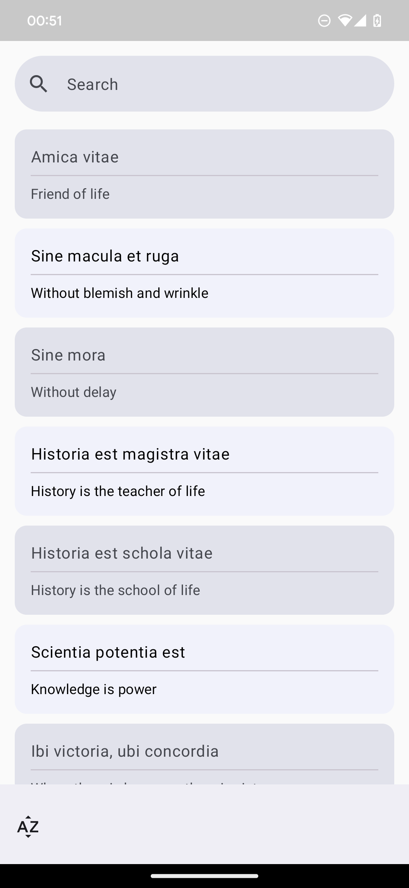

# LatinHelper

The LatinHelper is an Android app that helps users learn and practice Latin phrases
in multiple languages. It provides a collection of phrases along with their translations, allowing
users to expand their vocabulary.

## Screenshots


|                                              |                                              |                                              |
|----------------------------------------------|----------------------------------------------|----------------------------------------------|
|  |  |  |


## Getting Started

To get started with the Phrase Learning App, follow these steps:

1. Clone the repository:

   ```shell
   git clone https://github.com/your-username/phrase-learning-app.git
   ```

2. Open the project in Android Studio.

3. Build and run the app on an Android device or emulator.

## Technologies Used

- Android SDK
- Kotlin
- RoomDB
- DaggerHilt

## Contributing

Contributions to the Phrase Learning App are welcome! If you have any ideas, suggestions, or bug
reports, please open an issue or submit a pull request. For major changes, please open an issue
first to discuss the proposed changes.

## License

This project is licensed under the Creative Commons Attribution-NonCommercial 4.0 International
License. For more information, see the LICENSE file.

## Contact

For any inquiries or questions, please contact the project maintainer:

Mykhailo Fomenko  
Email: michael@fomenko.dev
